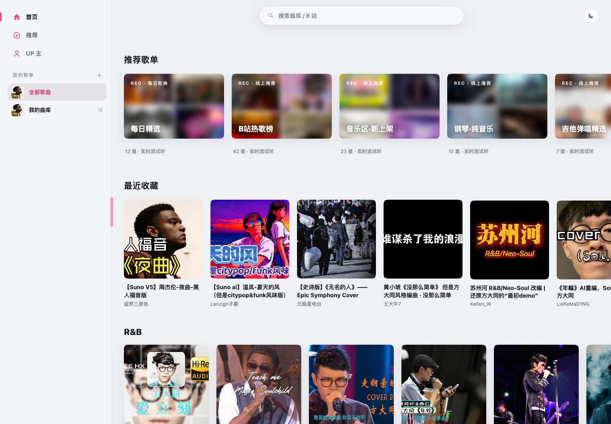

<p align="center"></p>
<h1 align="center">BiliMusic</h1>
<p align="center">Your personal player for music on Bilibili.</p>
<p align="center"><a href="README.md">简体中文</a> · <strong>English</strong></p>

BiliMusic is a personal web music player powered by Bilibili. Search for tracks, explore recommendations, and organize favorites on desktop and mobile. FastAPI serves a lightweight, server-rendered interface with no frontend build step. The current interface is in Chinese.



## Features

| Feature | Description |
| --- | --- |
| Online playback | Proxies Bilibili audio with seek support; normal playback does not store full audio files |
| Discovery | Search videos and creators, daily picks, genres, and creator uploads |
| Continuous listening | Search and recommendation queues support previous, next, and automatic advancement |
| Favorites and playlists | Import video or favorites-folder links and sync with Bilibili's `bilimusic` folders |
| Lyrics | Synchronized lyrics when timed subtitles or lyrics are available |
| Responsive interface | Desktop sidebar, mobile navigation, light and dark themes, pink glass selection animation |
| Account isolation | QR-code sign-in, separate account libraries, locally stored credentials |

## Mobile Experience

<p align="center"></p>

Access the same server from a mobile browser. The glass highlight slides between navigation items and respects reduced-motion preferences. Clicking X removes a track immediately; failed deletion restores the row and shows a message.

## Quick Start

### Install a Standalone App

Download DMG, EXE, or APK installers from [GitHub Releases](https://github.com/LQ-1123/bilibilimusic/releases). Each installer embeds Python and the backend, so no separate server is needed.

Desktop uses **Tauri 2 and the system WebView**, retaining the existing frontend and Python backend. Android keeps its native WebView and Chaquopy integration. Windows installers include offline WebView2 installation support.

| System | Installer |
| --- | --- |
| macOS 14+ Apple Silicon | `*-mac-arm64.dmg` |
| macOS 14+ Intel | `*-mac-x64.dmg` |
| Windows 64-bit | `*-win-x64.exe` |
| Android 8+, ARM64 / x86_64 | `*-android.apk` |

Desktop installers are not developer-signed or notarized and may trigger OS security prompts. Android uses a persistent project signing key; background playback and lock-screen controls are not guaranteed in this initial version. All platforms require internet access to Bilibili. See [packaging instructions](docs/packaging.md).

### Run from Source

Python 3.13 is recommended. The server needs access to Bilibili APIs and audio CDNs.

```bash
python3.13 -m venv .venv
source .venv/bin/activate
pip install -r requirements.txt
python -m uvicorn app.main:app --host 127.0.0.1 --port 8000
```

Open **http://127.0.0.1:8000**. On Windows, activate with `.venv\Scripts\activate`.

1. Sign in to Bilibili using the QR-code account flow.
2. Search for music or paste a video or favorites-folder link.
3. Click a track to stream it and use Next within recommendation or search lists.
4. Organize tracks into playlists or export a Bilibili favorites-folder link to share.

**Deleting a track also attempts to remove its corresponding Bilibili favorite.**

### Access from Your Phone

Connect your computer and phone to the same local network, then run:

```bash
python -m uvicorn app.main:app --host 0.0.0.0 --port 8000
```

Visit `http://YOUR_COMPUTER_LAN_IP:8000`. Defaults are intended for localhost or a trusted LAN. Configure HTTPS and access control before deploying for remote access.

## Configuration and Data

| Environment variable | Default | Purpose |
| --- | --- | --- |
| `BM_DATA_DIR` | Project's `data/` | Database, account credentials, caches |
| `BM_API_TOKEN` | Empty | Optional Bearer authentication for `/api/*`; media also accepts `?token=` |
| `BM_ALLOW_ORIGINS` | `*` | Comma-separated CORS origins |
| `BM_HOST` / `BM_PORT` | `0.0.0.0` / `8000` | Bind settings when using `python -m app.main` |

When launching Uvicorn directly, use `--host` and `--port`. The API token does not protect the entire web interface.

Back up `data/`, but never commit its databases or cookies. The current version streams online and does not provide an offline music library. Startup migration attempts to convert older local audio records to online playback and removes old files after successful migration.

## Development

Built with Python, FastAPI, SQLite / SQLModel, httpx, Jinja2, htmx, and vanilla JavaScript.

```text
app/
  api/          API routes and audio stream proxy
  bili/         Bilibili client, signing, link parsing
  db/           SQLite data models
  services/     Accounts, imports, sync, recommendations, lyrics
  web/          Routes, templates, CSS, JavaScript
tests/          Python and JavaScript regression tests
docs/images/    README screenshots
```

Run tests (JavaScript tests require Node.js):

```bash
python -m pytest -q
node --test tests/test_*.js
```

Interactive API documentation: **http://127.0.0.1:8000/docs** while the server is running.

## Troubleshooting

**A video plays on Bilibili, but the player reports it may be unavailable.**

This is a generic media-error message, not proof that the video was removed. Check the backend, terminal logs, Bilibili session, and network connectivity. API or CDN connection failures can prevent playback too.

**Some tracks have no lyrics or cannot play.**

Lyrics availability, video permissions, regional restrictions, removed content, and Bilibili API changes can affect availability. Streaming requires an active internet connection.

## Usage

This project is not affiliated with Bilibili. It is intended for personal use and learning. Audio, video, and artwork belong to their respective rights holders; follow platform rules and content permissions. Screenshot content is shown to illustrate the interface.
