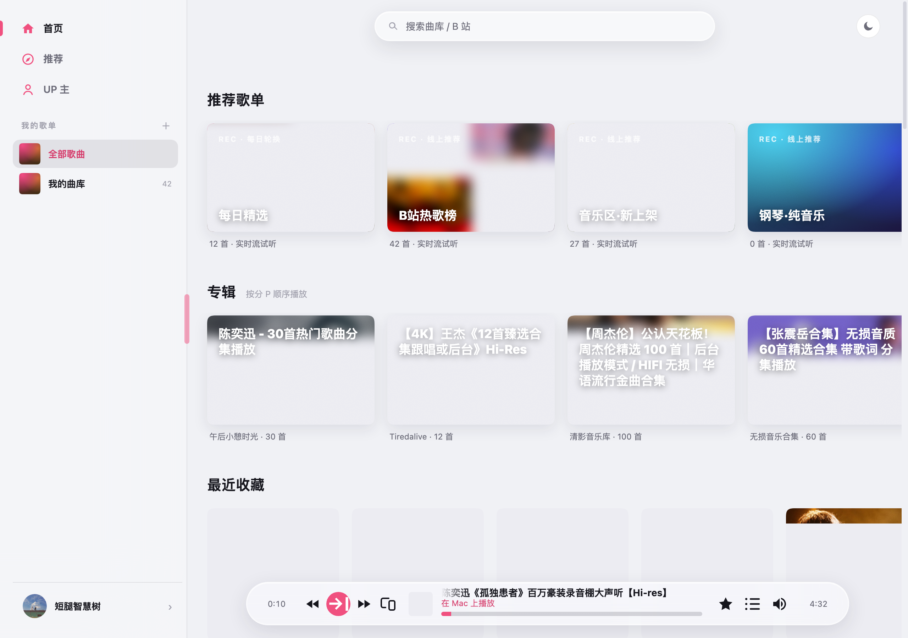
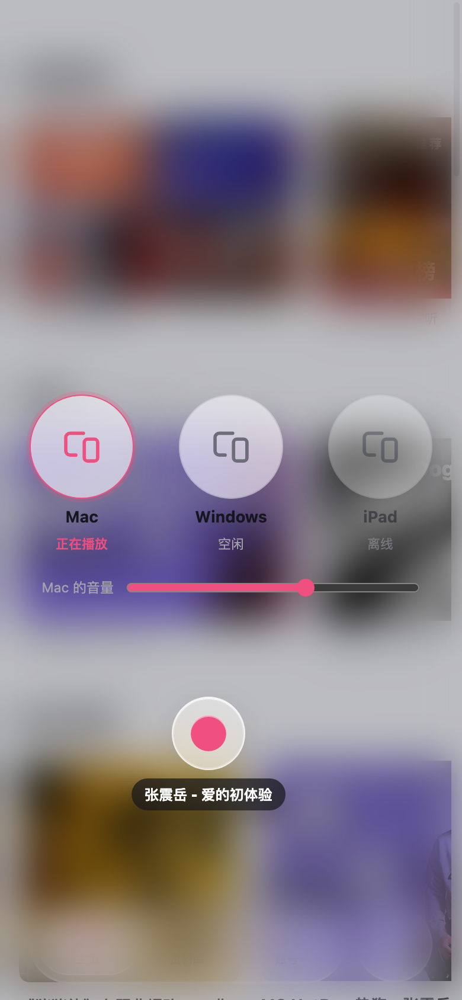
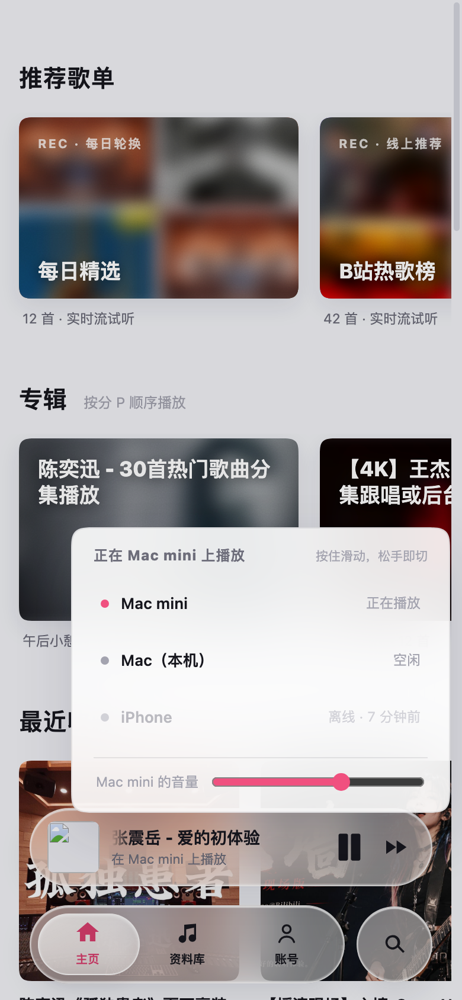
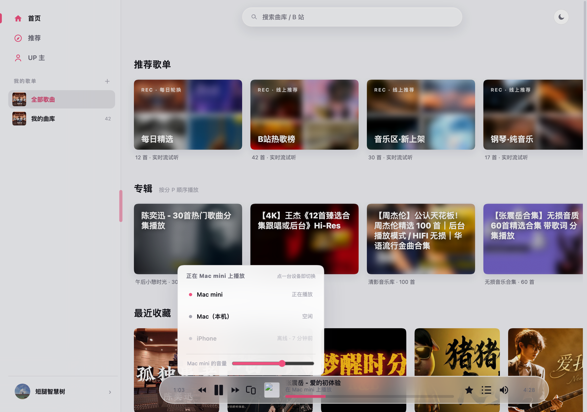
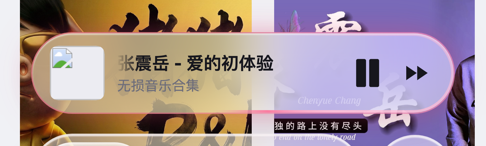

<p align="center"></p>
<h1 align="center">BiliMusic</h1>
<p align="center">把 B 站里的音乐，放进自己的播放器。</p>
<p align="center"><strong>简体中文</strong> · <a href="README.en.md">English</a></p>

BiliMusic 是基于 Bilibili 的个人音乐播放器：搜索、发现、收藏、歌单都在一个轻量的 Web 界面里完成；后端 FastAPI，界面服务端渲染，不需要前端构建。

**v2.0.0 的主线是跨端串流。** 同一局域网里的手机和电脑共享同一份播放会话：手机在放歌，电脑的播放条上就是那首歌，按一下中键声音就过来；在手机上把播放条往上一拖，声音又回到电脑。谁在放、谁在遥控，看播放条就知道。



## 跨端串流

| 能力 | 说明 |
| --- | --- |
| 零点击自动连接 | 手机打开后自动扫描局域网（约定端口 8000），按账号指纹认出同一账号的电脑并接上，正在放歌的那台优先。找不到就安静地用本机，不弹错、不打断。 |
| 播放条即遥控器 | 任意设备的播放条都会镜像另一台正在播放的内容与进度。上一首、下一首、暂停、拖进度、拖音量，全部作用在「正在出声的那台」上。 |
| 手势串流（手机） | 把播放条往上拖：条子缩成一颗小团跟手，背景虚化，设备变成页面中央的球阵，松手落在哪台就串到哪台；往下拉＝回到本机播放。长按中键同样可以唤出设备浮层。 |
| 桌面端设备列表 | 桌面不绑长按：点播放条上的设备图标打开设备列表，点一行即切换。 |
| 串流态点歌＝对面换歌 | 手机当遥控时点歌——含未收藏的试听、主页推荐、最近播放——队列交给在放的那台，声音在那边响，手机自己不出声，不会两头一起放。 |
| 详情页跟随远端 | 镜像态打开歌曲详情页或歌词页，看到的是远端正在放的那首：歌词、进度、播放键、上下曲全部遥控对面。 |
| 粉色光晕＝串流标识 | 镜像态播放条走一圈沿边游走的粉色光点；歌手位仍是歌手名（设备名放在 hover 里），点歌手跳到远端那首的 UP 主页。 |
| 全程零提示 | 切换设备的成功与进度不弹任何胶囊，结果只由播放条呈现（镜像 + 粉光）；只有失败才出声。 |

### 怎么用

| 想做的事 | 操作 |
| --- | --- |
| 手机 → 电脑 | 电脑打开页面，点播放条中键「⇢ 串流到本设备」；或在桌面上点设备图标 →「在此设备播放」。 |
| 电脑 → 手机 | 手机上长按播放条中键，或把播放条往上拖，松手落在电脑那颗球上。 |
| 从电脑拿回来 | 手机把播放条往下拉。 |
| 遥控另一台 | 在任意设备上按播放条的中键、上下曲、进度或音量——作用在正在出声的那台。 |

### 前提与边界

- 两端必须在**同一局域网**（/24 网段、无 AP 隔离），且登录**同一个 B 站账号**；电脑端后端要在运行。
- 桌面 App 默认以局域网模式监听 8000 端口；从源码启动则需要 `--host 0.0.0.0 --port 8000`。
- 设置了 `BM_API_TOKEN` 的后端不会被陌生设备发现：自动连接要求两端使用同样的令牌配置。
- 跨网络（手机 4G 连家里）不在本期范围；两端挂上 Tailscale 之类的组网工具即可按局域网方式使用。
- 会话保存在内存里，后端重启即重建，客户端会自动重新注册设备，无需手动清理。
- 浏览器标签页关闭即停播（Web 限制）；Android 端后续可做后台播放。
- 已知问题：PC 播放条歌名 ≤15 字符时，两侧磨砂遮罩仍会吃掉首尾（台账 #28）。

## 功能

| 功能 | 说明 |
| --- | --- |
| 在线播放 | 后端代理 B 站音频流，支持进度拖动；正常播放不保存整首音频 |
| 搜索与发现 | 搜索视频和 UP 主，浏览每日精选、风格推荐及 UP 主作品 |
| 连续收听 | 推荐和搜索列表建立在线队列，支持上一首、下一首及自动续播 |
| 收藏与歌单 | 粘贴视频或收藏夹链接导入，与 B 站 `bilimusic` 系列收藏夹同步 |
| 歌词 | 带时间轴的滚动歌词；镜像态跟随远端播放 |
| 跨端串流 | 同账号多设备共享播放会话：自动连接、播放条镜像、手势切换、全量遥控 |
| 多端界面 | 桌面侧栏、手机底部导航（3 Tab + 搜索圆钮）、亮暗主题、粉色玻璃选中动效 |
| 账号隔离 | 扫码登录，按账号保存曲库，登录凭据保存在本机 |

## 手机体验

<p align="center">


</p>

手机端底部只留 3 个 Tab 加一颗搜索圆钮：跨端入口全部收进播放条——往上拖（或长按中键）选设备，往下拉回本机。播放条与底部悬浮组严格等长（360 / 390 / 412 逐档量测过），歌手点击判定范围收回到文字本身。

<p align="center"></p>

桌面端点播放条上的设备图标打开设备列表：在放那台排最前，它的音量条就挂在自己名字下面，点一行即切换。



镜像态播放条会走一圈沿边游走的粉色光点，这是「我正在遥控另一台」的标识——不弹提示，也不打扰。

## 快速开始

### 安装独立客户端

前往 [GitHub Releases](https://github.com/LQ-1123/bilibilimusic/releases) 下载 DMG、EXE 或 APK。安装包内置 Python 后端，不需要另行启动服务器。

桌面端使用 **Tauri 2 + 系统 WebView**，保留现有网页和 Python 后端；Android 使用原生 WebView + Chaquopy。Windows 安装包包含 WebView2 离线安装支持。

| 系统 | 安装包 |
| --- | --- |
| macOS 14+ Apple Silicon | `*-mac-arm64.dmg` |
| macOS 14+ Intel | `*-mac-x64.dmg` |
| Windows 64 位 | `*-win-x64.exe` |
| Android 8 及以上，ARM64 / x86_64 | `*-android.apk` |

桌面版暂未使用开发者证书签名或公证，系统可能显示安全提示。APK 使用项目固定签名；首版不保证后台播放和锁屏控制。所有平台仍需联网访问 B 站。详细构建步骤见 [打包说明](docs/packaging.md)。

### 从源码启动

推荐 Python 3.13。服务器需要能访问 Bilibili API 和音频 CDN。

```bash
python3.13 -m venv .venv
source .venv/bin/activate
pip install -r requirements.txt
python -m uvicorn app.main:app --host 127.0.0.1 --port 8000
```

打开 **http://127.0.0.1:8000**。Windows 使用 `.venv\Scripts\activate` 激活环境。

1. 在账号入口扫码登录 B 站。
2. 搜索歌曲，或粘贴 B 站视频、收藏夹分享链接。
3. 点击歌曲在线播放，在推荐和搜索列表内可直接切换下一首。
4. 将歌曲加入歌单，或导出 B 站收藏夹链接分享。

**删除歌曲也会尝试取消对应的 B 站收藏。**

### 手机访问

让电脑和手机连接同一局域网，改用下面的命令启动（监听局域网并占用跨端发现的约定端口）：

```bash
python -m uvicorn app.main:app --host 0.0.0.0 --port 8000
```

手机浏览器打开 `http://电脑局域网IP:8000`，两端指向同一个后端，跨端串流即可使用。Android App 无需手填地址：同一 Wi-Fi 下会自动发现并接上电脑后端。

默认配置面向个人本机或可信局域网；远程部署需自行配置 HTTPS 和访问控制。

## 配置与数据

| 环境变量 | 默认值 | 用途 |
| --- | --- | --- |
| `BM_DATA_DIR` | 项目下的 `data/` | 数据库、账号凭据及缓存目录 |
| `BM_API_TOKEN` | 空 | `/api/*` 的可选 Bearer Token 鉴权，媒体也支持 `?token=` |
| `BM_ALLOW_ORIGINS` | `*` | CORS 来源，多个来源用逗号分隔 |
| `BM_HOST` / `BM_PORT` | `0.0.0.0` / `8000` | 使用 `python -m app.main` 启动时的监听配置；`BM_PORT` 同时是跨端发现的约定端口 |

显式使用 Uvicorn 时以 `--host`、`--port` 为准。API Token 不等于整个网页的访问控制；配了 Token 的后端不会被同网段的陌生设备自动发现。

备份时保留 `data/`；不要提交其中的数据库或 Cookie。当前版本以在线播放为主，不提供离线音乐库。旧版本本地音频会在启动迁移时尝试转为在线记录，迁移成功后移除旧文件。

## 开发

技术栈：Python · FastAPI · SQLite / SQLModel · httpx · Jinja2 · htmx · 原生 JavaScript。

```text
app/
  api/          API、音频流代理、局域网发现
  bili/         B 站客户端、签名与链接解析
  db/           SQLite 数据模型
  services/     账号、导入、同步、推荐、歌词、跨端会话
  web/          页面路由、模板、CSS 与 JavaScript
tests/          Python 与 JavaScript 回归测试
docs/images/    README 界面截图
docs/shots/     跨端串流等功能的界面留档
```

运行测试（JavaScript 测试需要 Node.js）：

```bash
python -m pytest -q
node --test tests/test_*.js
```

跨端串流的无头端到端回归：先起一个测试后端与无头 Chrome，再 `node scripts/e2e-streaming.mjs`；一键脚本 `scripts/e2e-streaming.sh` 不会打扰正在运行的 8000 实例。

启动后访问 **http://127.0.0.1:8000/docs** 查看交互式 API 文档。

## 常见问题

**手机没有自动连上电脑？**

依次确认：同一 Wi-Fi（无 AP 隔离）、电脑端已登录同一 B 站账号且后端在运行、电脑端监听的是 8000 端口、两端没有配置不一致的 `BM_API_TOKEN`。都正常时可以下拉或重开页面重新扫描。

**视频在 B 站能播放，为什么这里提示失效？**

“视频可能已失效”是通用媒体错误提示，不一定代表视频下架。先检查后端是否运行，再检查终端日志、B 站登录状态及网络连接。API 或 CDN 连接失败也会导致播放失败。

**为什么部分歌曲没有歌词或无法播放？**

歌词来源、视频权限、地区限制、内容下架及 B 站接口变化都会影响可用性。在线播放需要持续联网。

## 使用说明

本项目与 Bilibili 无官方关联，仅供个人学习与使用。音视频及封面权利归各自权利人所有，请遵守平台规则和内容授权。截图内容仅用于展示界面。
